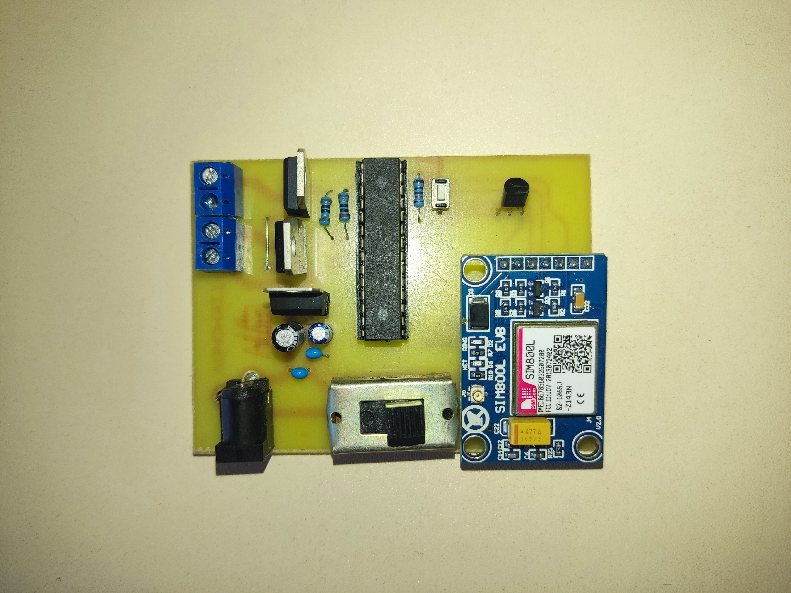

# Система контроля теплиц с удаленным мониторингом через GSM

## Принцип работы устройства

Датчик температуры на каждый дополнительный градус Цельсия обеспечивает увеличение напряжения на 10 мВ на своем выходе, подключенном к выводу микроконтроллера. Микроконтроллер в свою очередь считывает напряжение, которое подает датчик температуры, затем преобразовывает его в градусы и сравнивает с заданными пределами. Если температура выходит за один из пределов, срабатывает условие: один из транзисторных ключей открывается, подавая напряжение на нагрузку, а также отправляется смс с описанием действий, которые будет выполнять устройство.

[Firmware](./firmware.ino)

## Электронно принципиальная схема

## Расположение элементов

## Монтажная схема

## Устройство

